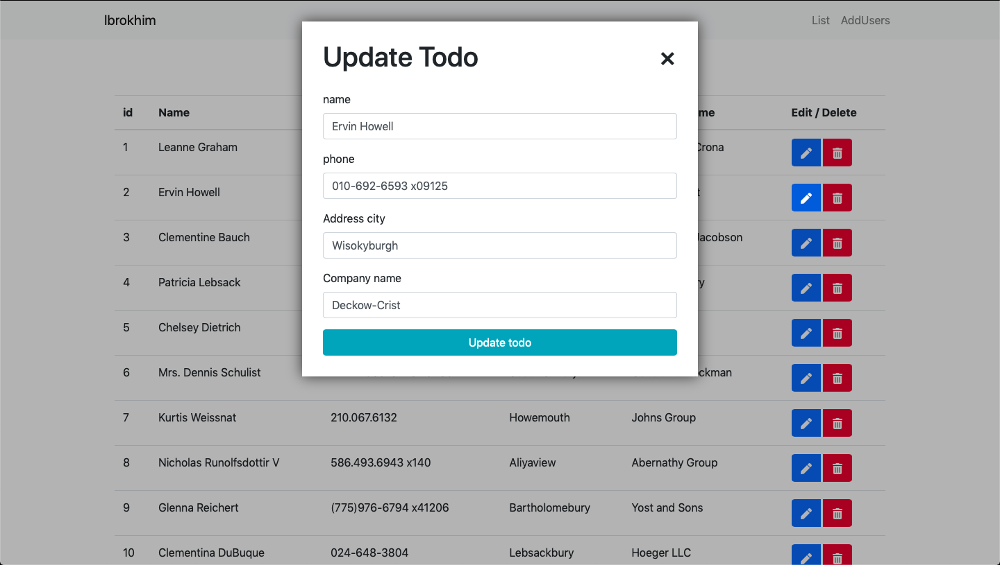

<h1 align="center">Welcome to CRUD fetch practic lesson by Ibrokhim 👋</h1>
<p>
  
</p>

> Bu loyihada CRUD ammalari fetch orqalik amalga oshiriladi.

> This is React book app store for learning Reactjs

### 🏠 [Homepage](https://react-crud-fetch.vercel.app/)

## Install

```sh
yarn install
```

## Usage

```sh
yarn start
```

## Run tests

```sh
yarn test
```

## Author

👤 **Ibrokhim Ismoilov**

- Website: https://Ibrokhim.uz
- Github: [@ibrokhim017](https://github.com/ibrokhim017)

## Show your support

Give a ⭐️ if this project helped you!

## Images

